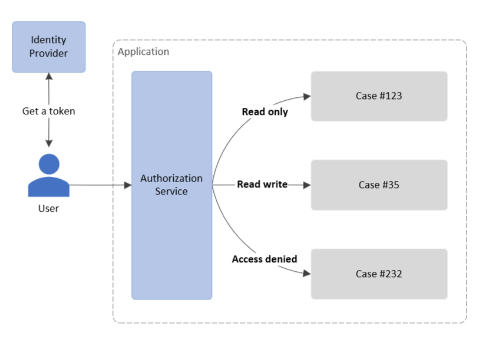

# Custom authorization or in-app authorization

This PoC contains a sample solution for handling custom authorization within a modern application.

## The problem

Most of the modern applications are using OAuth or OpenID Connect to authenticate and authorize their users. However, in some cases it is necessary to grant  the differnet permissions to a user based on the resource that he is accessing in the application.


A token issued by identity provider can help us to authenticate a user. But it can't help to authorize access because identity provider can issue a token to a user only based on his role within the application but not based on the specific resource in the application that user is accessing.

In this case, in addition to the token, the custom authorization can help to authorize access. However, during the implementation the next requirements should be taken into account:

- There should be the only one place where authorization rules are configured
- The framework authorization mechanisms should be used to avoid inserting everywhere conditions like ```if (<check-user-role>) then ...```
- Solution should be generic and provide a simple way to inject a business logic to provide or restrict an access for a user

## The solution

There are multiple solution to solve this problem. But taking into account the requirements above, we recommend to add a service (named here as AuthorizationService) to the request execution pipeline. This service is responsible for enriching the request with the roles of the current user, based on the business logic of your application, and then passing this information on to further processing of the request.



You can find the recommended implementation for the .NET applications below.

## The achitecture


Let's look at the flow:

1. Unauthenticated user is redirected to Identity Provider (for example - Azure AD) where he logs-in
2. Identity Provider issues a token and return it to a user's browser
3. The browser uses this token to access an application
4. The standard Authentication middleware validates the presented token and initializes User.Identity object that contains all the inforamtion about a user (including user's groups as well)
5. The custom middleware `InjectRolesMiddleware`, injected after the Authentication middleware and before the Authorization middleware, calls the service to get the users's role
6. The service `AuthorizationService` implements the business logic to get roles for the current user. To get the roles for the user, it can use external storage (like SQL or NoSQL databases), internal storage (like files or memory) or external service (available via HTTP).
7. The service returns the user's roles which will be injected, by the `InjectRolesMiddleware`, into the User.Identity object as the role claims
8. The standard Authorization middleware will use (by default) these injected roles to authorize or deny access

## The code

You can find multiple projects within [src](./src) folder.

### [Api.Minimal](./src/Api.Minimal)
This project shows implementation of this solution for the ASP.NET WebAPI application that is built using Minimal API.

- There is a new authorization policy defined in `Program.cs` file:
  ```csharp
    options.AddPolicy("RequireAccessToSecret", policy => policy.RequireRole("AccessToSecret"));
  ```

- The `DummyAuthorizationService` is registered in `IServiceCollection` in `Program.cs` file:
  ```csharp
    builder.Services.AddScoped<IAuthorizationService, DummyAuthorizationService>();
  ```

- The `InjectRolesMiddleware` injected into the pipeline in `Program.cs` file:
  ```csharp
    app.UseInjectedRoles();
  ```

- Require created above authorization policy for `/weatherforecast` method in `Program.cs` file:
  ```csharp
    .RequireAuthorization(new[] { "RequireAccessToSecret" });
  ```

### [Api.Mvc](./src/Api.Mvc)
This project shows implementation of this solution for the ASP.NET WebAPI application that is built using MVC.

### [Shared](./src/Shared)
This project is referenced by all the other projects and contains the implementation for the custom middleware [InjectRolesMiddleware](./src/Shared/Middlewares/InjectRolesMiddleware.cs). It also declares the interface [IAuthorizationService](./src/Shared/Services/IAuthorizationService.cs) and contains an implementation for this interface called [DummyAuthorizationService](/src/Shared/Services/DummyAuthorizationService.cs). This service is just a simple and naive examle of implementation of the `IAuthorizationService` interface. You should create your own custom implementation of this interface based on your business authorization rules and register this service as a scoped service in `IServiceCollection` in `Program.cs` file:
```csharp
  builder.Services.AddScoped<Shared.Services.IAuthorizationService, YourCustomAuthorizationService>();
```

### [Web.Mvc](./src/Web.Mvc)
This project shows implementation of this solution for the ASP.NET Web application that is built using MVC.

### [Web.Razor](./src/Web.Razor)
This project shows implementation of this solution for the ASP.NET Web application that is built using Razor Pages.
