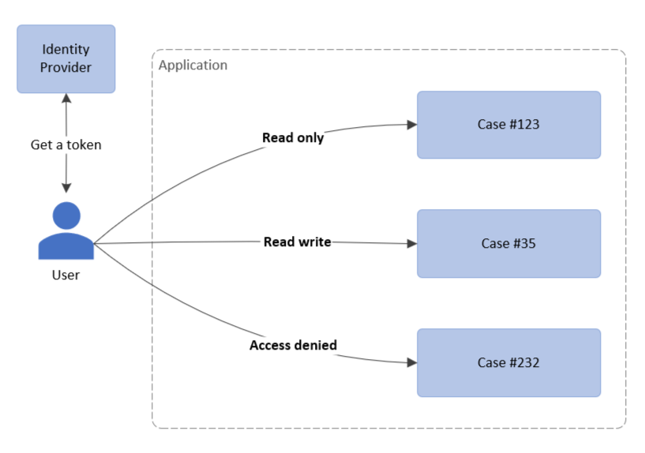

# Custom authorization or in-app authorization

This PoC contains a sample solution for handling custom authorization within a modern application.

### The problem

Most of the modern applications are using OAuth or OpenID Connect to authenticate and authorize their users. However, in some cases, there is a need to provide to a user differnet permissions based on the resource that he accessed within an application.

